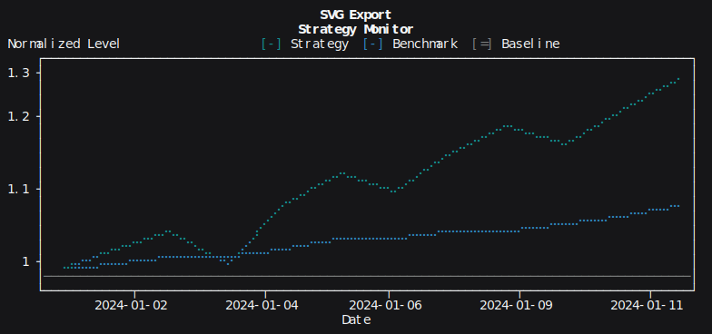

# SVG Export

`TermPlot.jl` can export the same chart output as SVG via `render_svg` and `render_svg!`.
The SVG renderer reuses the text layout, box drawing, braille rasterization, ANSI colors, and bold titles from the terminal renderer.

## Preview

The preview below is a committed SVG asset generated with `render_svg`.



## Export To A String

```julia
using Dates
using TermPlot

fig = Figure(title="SVG Export", width=96, height=22)
panel!(
    fig;
    title="Strategy Monitor",
    xlabel="Date",
    ylabel="Normalized Level",
    x_date_format=dateformat"yyyy-mm-dd",
)

x = [Date(2024, 1, 1) + Day(i) for i in 0:11]

line!(
    fig,
    x,
    [1.0, 1.03, 1.05, 1.01, 1.08, 1.12, 1.10, 1.15, 1.18, 1.16, 1.20, 1.24];
    label="Strategy",
    color=:cyan,
)

line!(
    fig,
    x,
    [1.0, 1.01, 1.02, 1.02, 1.03, 1.04, 1.04, 1.05, 1.05, 1.06, 1.07, 1.08];
    label="Benchmark",
    color=:blue,
)

hline!(fig, 1.0; label="Baseline", color=:gray)

svg = render_svg(fig)
write("chart.svg", svg)
```

## Stream To An IO

Use `render_svg!` when you want to write directly to a file or buffer.

```julia
open("chart.svg", "w") do io
    render_svg!(io, fig)
end
```

## Display As SVG

The package also provides `show(io, MIME"image/svg+xml"(), fig)`, which is useful in notebook-style environments or wherever an SVG MIME display is supported.

```julia
show(stdout, MIME"image/svg+xml"(), fig)
```

## Notes

- The default font stack starts with `JuliaMono`, then falls back through modern monospace fonts that render box drawing and braille well.
- Colors and bold titles are preserved in the SVG output.
- The layout stays tied to the terminal renderer, so terminal and SVG output remain visually aligned.
