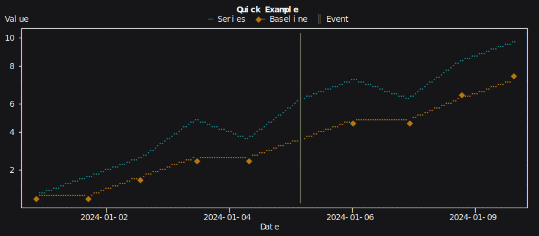

# TermPlot.jl

`TermPlot.jl` is a pure Julia terminal plotting library for line charts, stem plots, bar charts, scatter plots, stacked bars, guide lines, flexible axis control, and seam-aware `GridLayout` multi-panel figures.

It is designed for direct REPL and script usage:

- Unicode terminal rendering
- ANSI colors when available
- `Date`, `DateTime`, and `ZonedDateTime` x-axes
- Dual y-axes in one plot area
- Weighted multi-panel figures with row and column spans
- Optional aligned plot areas via `rowaligns` and `colaligns`
- Adjacent subplots controlled seam-by-seam

## Quick Start

```julia
using Dates
using TermPlot

fig = Figure(title="Quick Example", width=112, height=24)
panel!(fig, xlabel="Date", ylabel="Value", x_date_format=dateformat"yyyy-mm-dd")

x = [Date(2024, 1, 1) + Day(i) for i in 0:9]
line!(fig, x, [1, 2, 3, 5, 4, 6, 7, 6, 8, 9]; label="Series", color=:cyan)
line!(fig, x, [1, 1, 2, 3, 3, 4, 5, 5, 6, 7]; label="Baseline", color=:yellow, marker=:diamond)
vline!(fig, Date(2024, 1, 6); label="Event", color=:gray)

display(fig)
```

Rendered SVG preview of the same figure:



## Guides

- [Concepts](concepts.md): `Figure`, `Panel`, current-panel behavior, spans, and layout placement rules
- [API Reference](api.md): public constructors, plotting primitives, axis mutators, and keyword parameters
- [Rendering Output](rendering.md): plain-text rendering, `IO` usage, color control, and SVG export hooks

## Examples

The documentation includes an organized examples section with separate pages for:

- line charts
- stem plots
- bar charts
- stacked bars
- scatter plots
- reference lines
- axis options
- messy data handling
- layouts
- labels and legends
- SVG export

## Development

Run tests with:

```bash
julia --project -e 'using Pkg; Pkg.test()'
```

Build docs with:

```bash
julia --project=docs docs/makedocs.jl
```
